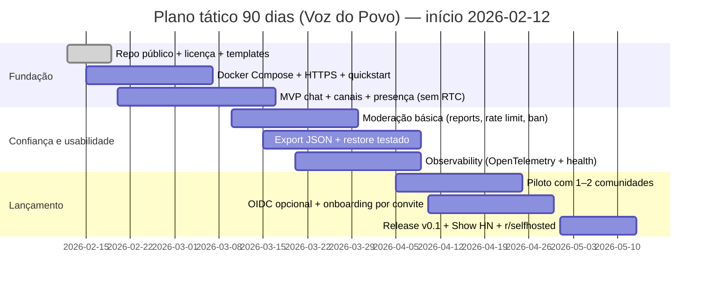

# Mapeamento de projetos e canais para orientar o “Voz do Povo”

## Resumo executivo

O ecossistema de comunicação/comunidades (chat + voz + vídeo) está dividido em dois “mundos” que raramente se encaixam sem dor: (1) **produtos completos de comunidade/mensageria** (ex.: Discourse, Rocket.Chat, Zulip, ecossistema Matrix/Element, Nextcloud Talk) e (2) **infra de mídia WebRTC** (SFU/gateways/TURN, como LiveKit, mediasoup, Janus e coturn). Como consequência, quase todo projeto que tenta virar “Discord/Slack/Zoom self-hosted” acaba tropeçando em três frentes: **operação**, **governança/moderação** e **licenciamento**. citeturn18view0turn5view3turn6view1turn17view0turn9view2turn40view1turn29view0turn5view0turn5view2

Do ponto de vista de estratégia de produto, a maior oportunidade para o “Voz do Povo” não é “mais um chat”: é **entregar soberania de dados + governança comunitária + deploy/observability por padrão**, com uma arquitetura de mídia que não te prenda num único backend. Em termos práticos: começar com **um MVP de texto/presença + moderação básica + export/backup** e ir adicionando voz/vídeo com rigor operacional (TURN, métricas, limites), em vez de prometer “RTC completo” e cair num buraco sem fundo. citeturn40view1turn5view2turn29view1turn25view1turn38search3

Nos canais de distribuição, há um choque cultural: **Product Hunt** premia marketing e polish; **Show HN** e **r/selfhosted** punem marketing e fricção (pedem demo fácil, transparência e pouco spam). Isso impacta diretamente como lançar: primeiro credibilidade técnica (GitHub + Docker + demo), depois “vitrine” (Product Hunt). citeturn27search0turn27search1turn28search2turn28search14

Por fim, licenças: o cenário é uma colcha de retalhos—MIT/Apache convivem com **AGPL/GPL/LGPL** e com **open-core/source-available**. Se você não tratar licenciamento como requisito de arquitetura (não como “jurídico depois”), você vai plantar uma bomba-relógio para integrações, plugins e distribuição (inclusive F-Droid). citeturn38search3turn14search0turn9view0turn6view3turn8view0turn27search2turn35search10turn35search8

## Critérios e metodologia

Foram priorizados projetos e serviços que: (a) são frequentemente citados como alternativas self-hosted/OSS (chat/comunidade ou RTC), (b) têm sinais de maturidade (stars, releases recentes, volume de issues/PRs), e (c) têm implicações claras para o backlog do “Voz do Povo”: **moderação**, **identidade**, **export/backup**, **observability** e **infra de mídia**. As principais evidências vieram das páginas oficiais dos repositórios (GitHub/GitLab), documentação oficial e políticas/regras de marketplaces/comunidades (Product Hunt, Show HN, r/selfhosted, F-Droid, Docker Hub, GitHub Marketplace). citeturn27search0turn27search1turn28search2turn27search2turn28search0turn27search3

## Projetos e serviços mapeados

A tabela abaixo é **priorizada** pelo quanto cada item ajuda a construir (ou a posicionar) o “Voz do Povo” com o menor risco de retrabalho.

image_group{"layout":"carousel","aspect_ratio":"16:9","query":["Jitsi Meet interface screenshot","Rocket.Chat interface screenshot","Element web Matrix client screenshot","Zulip topics interface screenshot"],"num_per_query":1}

| Nome | URL | Categoria | Licença | Maturidade (stars / última atividade) | Linguagem/stack | Funcionalidades principais | Lacunas/oportunidades para Voz do Povo | Prioridade |
|---|---|---|---|---|---|---|---|---|
| entity["organization","LiveKit","webrtc sfu stack"] | `https://github.com/livekit/livekit` | SFU/WebRTC (OSS + Cloud) | Apache-2.0 | 17k★; release v1.9.11 (2026-01-15); 143 issues; 33 PRs citeturn40view1 | Go (server); SDKs; WebRTC via Pion citeturn40view1 | SFU; deploy (binário/Docker/K8s); SDKs; menção a APIs de moderação e E2EE citeturn40view1 | É “stack”, não produto final: espaço para governança, UX comunitária e portabilidade | alta |
| entity["organization","mediasoup","webrtc sfu library"] | `https://github.com/versatica/mediasoup` | SFU (baixo nível) | ISC | 7.1k★; release 3.19.17 (2026-02-05); 15 issues; 11 PRs citeturn29view0 | C++ (worker) + Node bindings + Rust citeturn29view0 | SFU modular; controle fino de mídia; demo online citeturn29view0 | Oportunidade: transformar “infra de SFU” em experiência de comunidade (admin, métricas, moderação) | alta |
| entity["organization","coturn","turn server project"] | `https://github.com/coturn/coturn` | STUN/TURN | (na prática) BSD-3-Clause; repo discute explicitar melhor citeturn5view2turn32search7turn31search9 | 13.6k★; release 4.7.0 (2026-01-29); 784 issues; 154 PRs citeturn5view2 | C | TURN/STUN para atravessar NAT/firewall (base de WebRTC em produção) citeturn5view2 | Oportunidade: “RTC que funciona em rede ruim” nasce aqui (diagnóstico, presets, custos) | alta |
| entity["organization","Jitsi Meet","webrtc video conferencing"] | `https://github.com/jitsi/jitsi-meet` | Videoconferência (produto) | Apache-2.0 | 28.6k★; release 2.0.10741 (2026-02-02); 100 issues; 71 PRs citeturn7view1 | TypeScript/JS citeturn7view1 | Meeting UI; base consolidada de conferência citeturn7view1 | Oportunidade: comunidades precisam de “vida contínua” (canais, governança), não só reuniões | alta |
| entity["organization","Synapse","matrix homeserver"] | `https://github.com/element-hq/synapse` | Servidor federado (Matrix) | AGPL-3.0 + licença comercial citeturn9view2 | 3.6k★; 1.8k issues; 119 PRs citeturn9view2 | Python/Twisted + Rust (partes) citeturn9view2 | Base para federação e ecossistema Matrix citeturn9view2 | Oportunidade: UX e governança “federada sem dor”, e templates de comunidade | alta |
| entity["organization","OpenTelemetry Collector","telemetry collector"] | `https://github.com/open-telemetry/opentelemetry-collector` | Observability | Apache-2.0 | 6.6k★; release v1.51.0/v0.145.0 (2026-02-02); 620 issues; 59 PRs citeturn25view1 | Go citeturn25view1 | Coleta/processamento/export de logs/métricas/traces; extensível citeturn25view0 | Oportunidade: “observability by default” como feature, não pós-venda | alta |
| entity["organization","Rocket.Chat","chat platform"] | `https://github.com/RocketChat/Rocket.Chat` | Chat/colaboração (open-core) | CE MIT; EE com termos próprios/source-available citeturn38search3turn5view3 | 44.6k★; release 8.1.0 (2026-02-10); 2.6k issues; 1.2k PRs citeturn5view3 | TypeScript/Node.js citeturn5view3 | Plataforma de comunicação customizável; docs apontam distinção CE vs EE citeturn38search3turn5view3 | Oportunidade: posicionar “sem fricção de licença/validação” e com portabilidade nativa | alta |
| entity["organization","Keycloak","iam oidc server"] | `https://github.com/keycloak/keycloak` | IAM/SSO | Apache-2.0 | 32.8k★; release 26.5.3 (2026-02-10); 2.2k issues; 302 PRs citeturn22view0 | Java (majoritário) citeturn22view2 | OIDC/SAML; user mgmt; auth forte citeturn17view2turn22view0 | Oportunidade: “SSO plugável” e onboarding com/sem SSO mantendo convites simples | alta |
| entity["organization","Janus WebRTC Gateway","webrtc gateway by meetecho"] | `https://github.com/meetecho/janus-gateway` | Gateway/plugin media server | GPL-3.0 | ~9k★; atualizado 2026-02-06 (org); repo mostra 137 issues e 12 PRs citeturn39view0turn5view0 | C; arquitetura por plugins citeturn39view0 | WebRTC server extensível (plugins) citeturn39view0 | Oportunidade: pode acelerar features específicas (SIP etc.), mas licencia/empacota com cuidado | média |
| entity["organization","BigBlueButton","virtual classroom"] | `https://github.com/bigbluebutton/bigbluebutton` | Sala de aula virtual | LGPL-3.0 citeturn8view0 | 9k★; release v3.0.22 (2026-02-11); 637 issues; 84 PRs citeturn8view0 | JS/TS/Scala/Java etc. citeturn8view0 | Ferramentas ricas de “aula ao vivo” (gravação, whiteboard, etc.) citeturn8view0 | Oportunidade: recortar o que é “comunidade” vs “aula”; stack pesada é barreira | média |
| entity["organization","Zulip","topic-based chat"] | `https://github.com/zulip/zulip` | Chat organizado por tópicos | Apache-2.0 | 24.6k★; release 10.2 (2026-02-05); 676 issues; 286 PRs citeturn6view1 | Web + server (repo aponta Python majoritário) citeturn6view1 | Conversas por streams/tópicos; foco em organização citeturn6view1 | Oportunidade: combinar organização + presença/voz sem virar caos; bom benchmark de UX de threads | média |
| entity["organization","Discourse","forum platform"] | `https://github.com/discourse/discourse` | Fórum + chat | GPL-2.0-or-later citeturn18view1 | 46.3k★; base muito madura; chat embutido citeturn18view0turn17view0 | Rails + Ember; Postgres + Redis citeturn17view0 | Discussões; moderação; plugins; chat built-in citeturn17view0 | Oportunidade: “conhecimento + governança” é excelente; falta RTC-first | média |
| entity["organization","Nextcloud Talk","nextcloud communication"] | `https://github.com/nextcloud/spreed` | Comunicação no ecossistema Nextcloud | AGPL-3.0 citeturn6view3 | 2.1k★; release v21.0.2 (2026-02-12); 763 issues; 128 PRs citeturn6view3 | PHP + integrações Nextcloud citeturn6view3 | Chat/chamadas integradas a arquivos/identidade do Nextcloud citeturn6view3 | Oportunidade: integração com storage/identidade é forte; mas acopla ao Nextcloud | média |
| entity["organization","Element Web","matrix client web"] | `https://github.com/element-hq/element-web` | Cliente web Matrix | AGPL-3.0 ou GPL-3.0 ou comercial (multi) citeturn9view0 | 12.6k★; release v1.12.10 (2026-02-10); 3.6k issues; 54 PRs citeturn9view0 | Web client; ecossistema Matrix citeturn9view0 | Cliente completo para comunidades (Matrix) citeturn9view0 | Oportunidade: benchmark de UX de criptografia e comunidades; licenciamento pode exigir atenção | média |
| entity["organization","Mattermost","chat collaboration platform"] | `https://github.com/mattermost/mattermost` | Chat/colaboração (open-core) | Política de licenças: MIT (binários), AGPL/comercial e exceções citeturn14search0turn10view1 | 35.3k★; release v11.3.0 (2026-01-08); 609 issues; 303 PRs citeturn10view1 | Go + React; Postgres (descrição do repo) citeturn14search7turn10view1 | Colaboração segura; foco em times/ambientes regulados citeturn14search7 | Oportunidade: tratar “comunidade” como primeiro cidadão (governança e portabilidade), não só “workplace” | média |
| entity["organization","OpenSearch","search analytics suite"] | `https://github.com/opensearch-project/OpenSearch` | Busca/indexação | Apache-2.0 citeturn35search5 | 12.4k★; repo ativo (issues/PRs altos) citeturn35search5 | Java (suite de search/analytics) citeturn35search5 | Base para busca e auditoria em escala citeturn35search13turn35search5 | Oportunidade: search “modular e opcional” (evitar obrigar stack pesada no MVP) | média |
| entity["organization","Stoat","revolt successor"] | `https://github.com/stoatchat/stoatchat` | Chat “Discord-like” | AGPLv3 (geral) citeturn17view3 | 2.3k★; release v0.11.0 (2026-02-10) citeturn17view3 | Rust + Redis + MongoDB (tópicos do repo) citeturn17view3 | Chat moderno e foco community-first citeturn17view3 | Oportunidade: maturidade menor abre espaço para “produto mais simples e governável” | média |
| entity["organization","restic","backup tool"] | `https://github.com/restic/restic` | Backup/export | BSD-2-Clause citeturn29view1 | 32.2k★; release 0.18.1 (2025-09-21); 444 issues; 73 PRs citeturn29view1 | Go citeturn29view1 | Backups criptografados, verificação, dedupe citeturn29view1 | Oportunidade: “backup/restore 1-clique” e export auditável como feature nativa | média |
| entity["company","Daily","webrtc api provider"] | `https://docs.daily.co/` | SaaS WebRTC | Serviço proprietário; ecossistema com SDKs e docs citeturn34view1turn34view2 | Daily: lançado em 2017 e com seguidores (Product Hunt) citeturn34view2 | Infra gerenciada + SDKs | APIs para rooms/tokens e guias; foco dev citeturn34view1turn33search14 | Oportunidade: “modo self-host de verdade” + soberania/controle (anti lock-in) | baixa |
| entity["organization","Mumble","voip voice chat"] | `https://github.com/mumble-voip/mumble` | Voz (VoIP) low-latency | BSD-style (site diz BSD-style; arquivo LICENSE é público) citeturn21search5turn21search0turn19view0 | 7.6k★; release v1.5.857 (2025-10-21); 409 issues; 43 PRs citeturn19view0 | C++/Qt; Opus citeturn17view1 | Voz de baixa latência com servidor dedicado citeturn17view1 | Oportunidade: benchmark de “voz confiável”; gap é web-first + governança (“voz social”) | baixa |

Padrões observáveis a partir desse mapa:

O que parece “produto simples” vira “infra infinita”. Exemplos: stacks de SFU/gateway citam deploy e features, mas a responsabilidade operacional (qualidade, quedas, custos, TURN, diagnósticos) cai em você quando vira produto. LiveKit explicita deploy e features de rede/TURN, e isso é um sinal do tamanho do problema. citeturn40view1turn5view2

Open-core e copyleft estão em todo lugar. Rocket.Chat documenta distinção entre CE e EE, e Element/Synapse operam com multi-licença/dual licensing; Mattermost tem política de licenciamento com combinação de licenças e caminhos comerciais. Isso afeta diretamente plugin marketplace, distribuição e “forkabilidade” real. citeturn38search3turn9view0turn9view2turn14search0turn14search7

Governança comunitária é subatendida. Discourse e Zulip são fortes em estrutura de conversa e moderação (via plataforma e plugins), mas não resolvem “voz social” nativamente; já stacks RTC resolvem mídia, mas não resolvem governança. Essa lacuna é onde um produto “comunidade-first” pode vencer. citeturn17view0turn6view1turn40view1

## Marketplaces e canais de distribuição

Abaixo, uma leitura pragmática dos canais solicitados, com base em regras/documentação públicas e no “fit cultural” para self-hosted e devtools.

| Canal | Prós | Contras | Recomendação objetiva para o Voz do Povo |
|---|---|---|---|
| entity["company","Product Hunt","product discovery platform"] | Boa vitrine; guia oficial de lançamento e “best practices” citeturn27search0 | Pressiona por polish e marketing; fácil “queimar” o lançamento cedo | Lançar **depois** de ter demo estável + docs + prints/vídeo; usar como amplificador |
| entity["organization","Hacker News","tech news forum"] (Show HN) | Público técnico; regras incentivam testar sem barreiras; feedback honesto citeturn27search1turn27search10 | Punição instantânea a marketing; se não estiver pronto, vira backlash citeturn27search1 | Fazer Show HN quando houver demo pública **e** algo técnico real (arquitetura, trade-offs) |
| entity["company","GitHub","code hosting platform"] | Padrão de OSS; issues/PRs; reputação; social proof por stars/releases citeturn18view0turn26view0 | Não é canal de “usuário final”; discoverability depende de comunidade | Base primária do MVP: repo impecável, releases, templates, governança |
| entity["company","Docker Hub","container registry"] | Distribuição prática; docs oficiais sobre builds automáticos e tags citeturn28search0turn28search16 | Confiar só no “latest” é armadilha; supply chain e assinatura/importância de provenance | Publicar imagens oficiais do servidor + compose; automatizar build/test citeturn28search4turn28search20 |
| entity["organization","Indie Hackers","founder community"] | Bom para narrativa de construção e validação; público “builder” citeturn28search1 | Menos técnico que HN; pode virar ruído de marketing | Usar para “build in public” e recrutamento de pilotos, não como canal principal de OSS |
| entity["organization","r/selfhosted","subreddit selfhosted"] | Público altamente qualificado (self-hosted) e crítico; regras claras anti-spam citeturn28search2turn28search14 | Se parecer autopromoção, morre; exige transparência (“é meu projeto”) citeturn28search2 | Postar quando houver: docker-compose, docs, limitações explícitas e pedido de feedback |
| entity["organization","F-Droid","android foss repository"] | Distribuição Android alinhada a FLOSS; política de inclusão exige apps FLOSS e build a partir do fonte citeturn27search2turn27search5 | Requisitos e processo; se o app ou libs não forem FLOSS, pode barrar citeturn27search2 | Só mirar quando app mobile for FLOSS e build/reprodutibilidade estiverem sob controle |
| entity["company","GitLab","devops platform"] | Bom para comunidade que prefere GitLab/self-managed; fala de open-core e opções self-managed citeturn28search7turn28search15 | Distribuição fragmentada (parte da comunidade está em GitHub) | Manter espelho/compatibilidade; não precisa ser canal primário no começo |
| entity["organization","GitHub Marketplace","app marketplace"] | Canal de monetização B2Dev; métricas e listagem estruturada citeturn27search6 | Exige mínimos (ex.: 100 instalações para GitHub App; regras para apps pagos) citeturn27search3 | Só faz sentido se houver um “app” (GitHub App/Action) como produto adjacente |

Recomendação de lançamento do MVP (sem romantizar): se o objetivo é tração real para self-hosted, **GitHub + Docker Hub + r/selfhosted + Show HN** são o núcleo. Product Hunt entra quando você tiver material de vitrine e uma história clara (o que é, para quem é, por que existe), porque o guia oficial incentiva preparação e clareza de expectativa. citeturn27search0turn28search0turn28search2turn27search1

## Integrações estratégicas e riscos técnicos/legais/licença

Abaixo, 10 integrações que aumentam adoção e reduzem risco operacional—com um alerta: **a sua arquitetura vai herdar os riscos de licenciamento do que você embutir** (especialmente AGPL/GPL e modelos source-available). A métrica de sucesso aqui não é “integramos X”, é “é simples ativar/opcional/desativar sem quebrar o produto”.

| Integração/plug-in | Para que serve | Por que aumenta adoção | Riscos (técnicos/legais/licença) | Sugestão pragmática |
|---|---|---|---|---|
| entity["organization","Authelia","sso 2fa portal"] (OIDC/2FA) | SSO e MFA “na borda” (reverse proxy) | Facilita adoção em self-host sem stack pesada | Licença Apache-2.0 (baixo risco) citeturn36search6; risco é UX ruim se virar “gambiarra” | Suportar como OIDC provider “compatível”, sem acoplar |
| entity["organization","MinIO","s3 compatible object store"] (S3 self-host) | Storage compatível S3 para mídia/backups | Fundamental para anexos e gravações sem depender de vendor | AGPLv3 + licença comercial (dual) citeturn35search4turn35search8; impacto jurídico depende do uso/modificação | Tratar como dependência opcional; documentar alternativas (S3 real, filesystem) |
| entity["organization","Grafana","observability dashboards"] (dashboards) | Dashboards admin e NOC | Acelera operação e pilotos | Grafana mudou projetos core para AGPLv3 citeturn35search10turn35search18; avaliar estratégia de distribuição | Oferecer dashboards “compatíveis”, não embutir como obrigatório |
| entity["organization","Prometheus","metrics monitoring system"] (métricas) | Métricas e alertas | Stack padrão na prática; reduz MTTR | Apache-2.0 (baixo risco) citeturn26view0; risco é custo/complexidade se virar requisito | Expor métricas e sugerir integração; não obrigar no MVP |
| entity["organization","matterbridge","chat bridge tool"] (bridges) | Ponte entre protocolos (ex.: Matrix, IRC etc.) | Traz “usuários onde eles já estão” | Dependências podem impedir distribuir binários; release cita caso de lib GPL3 que força build manual citeturn35search11turn35search15; risco de ToS ao bridgear certas redes | Manter como add-on isolado; posicionar como “por sua conta e risco” |
| (Backends SFU já mapeados) | SFU (LiveKit/mediasoup) | Permite voz/vídeo escalável | Complexidade operacional; custos; tuning; possível lock-in se a API interna não abstrair citeturn40view1turn29view0 | Definir uma interface interna e plugar 1 backend primeiro |
| (TURN) | TURN (coturn) | Conectividade em redes ruins | Custos de tráfego e configuração; risco de indisponibilidade derrubar RTC citeturn5view2 | Incluir teste/diagnóstico TURN no painel admin |
| (Federação) | Matrix federation (Synapse) | Interop e soberania; ecossistema grande | Operação e modelo de segurança; AGPL/dual licensing no ecossistema citeturn9view2 | Tratar federação como fase 2/3, não como requisito do MVP |
| (Search) | Indexação (OpenSearch/alternativas) | Busca e auditoria em escala | Custo e operação; precisa garantir permissões na busca | Tornar módulo opcional; fallback para busca simples no DB |
| (Observability) | OpenTelemetry Collector | Telemetria padronizada e neutralidade de vendor | Adoção depende de “defaults”; risco de virar “config hell” citeturn25view0turn25view1 | Shipar com config padrão e docs curtas + dashboards |

Posicionamento (open-core vs fully open-source):

Se o “Voz do Povo” quer ganhar o público de comunidades e self-hosted, **credibilidade > feature list**. Um núcleo com licença OSI (Apache/MIT/AGPL etc.) facilita adoção e distribuição; a Open Source Initiative explicita que “open source” depende de termos de distribuição compatíveis com critérios como redistribuição livre. citeturn37search1

Open-core pode funcionar, mas só se você for brutalmente transparente sobre o que é “core” e o que é comercial. O problema é que, para esse público, open-core frequentemente soa como “bait-and-switch”. E quando você mistura isso com licenças fortes (AGPL) e mudanças de licenciamento no ecossistema (como o caso público de relicenciamento para AGPL em projetos de observability), você aumenta a desconfiança e o risco de adoção. citeturn35search10turn35search18turn35search8turn37search0

Minha recomendação (opinião e estratégia): **fully open-source para o core** (servidor + cliente web + protocolo/API) e monetização via **hosting gerenciado**, **suporte**, **serviços** e **módulos de conveniência** (ex.: “admin pack”, templates, migração assistida)—sem tirar direitos fundamentais do usuário self-host. Se você optar por open-core, trate isso como risco reputacional e faça “contrato social” público (roadmap, limites claros, sem surpresas).

## Sugestões de nomes e descrições curtas para listings

Voz do Povo é um nome forte, mas para canais como GitHub/Product Hunt você provavelmente vai querer um subtítulo que explique “o que é” em 1 linha.

Voz do Povo — Comunidades soberanas  
Plataforma self-hosted de comunidade com governança, portabilidade e comunicação em tempo real.

Voz do Povo — Community OS  
Chat + moderação + exportação + observability, com voz/vídeo modular quando você precisar.

Voz do Povo — Civic Comms  
Comunicação para comunidades e coletivos: controle de dados, regras claras e infraestrutura transparente.

Voz do Povo — Self-hosted Communities  
Uma alternativa prática para construir comunidades com autonomia e trilha de governança.

Voz do Povo — Open Community Stack  
Um stack open-source para comunidades: identidade, mensagens, mídia e auditoria.

## Plano de ação tático e checklist de lançamento

### Timeline em mermaid

### Checklist de lançamento

Licença e governança: escolher licença do core coerente com o posicionamento; incluir CONTRIBUTING, Code of Conduct e política de segurança; declarar claramente o que é opt-in (telemetria) e o que é default.

Distribuição: publicar imagem no Docker Hub com tags versionadas (evitar depender de latest), e automatizar build/test. citeturn28search0turn28search16turn28search20

Conteúdo mínimo: README “quickstart”; diagrama simples; demo pública; screenshots; vídeo curto (2–3 min); limitações explícitas e roadmap.

Comunidade: abrir issues com templates; criar espaço de discussão; primeira rodada de feedback em r/selfhosted respeitando regras anti-spam e transparência. citeturn28search2turn28search14

### Arquivos exportáveis para backlog e planejamento

[Download do mapeamento (20 projetos/serviços)](sandbox:/mnt/data/voz_do_povo_mapeamento_20_projetos.csv)

[Download do backlog de features recomendadas](sandbox:/mnt/data/voz_do_povo_backlog_features.csv)

[Download do plano tático 90 dias (Markdown)](sandbox:/mnt/data/voz_do_povo_plano_90_dias.md)