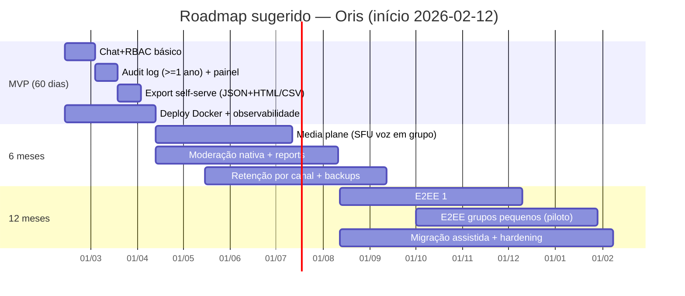
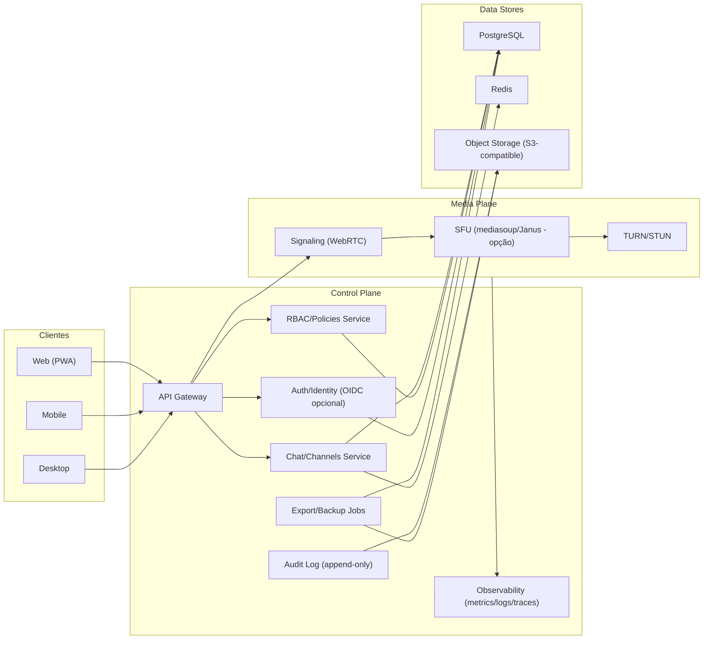

# Relatório analítico de lacunas do Discord, Slack e Zoom para orientar o “Oris”

## Resumo executivo

Este relatório examina, com evidências documentais e exemplos concretos, os principais pontos negativos de Discord, Slack e Zoom quando o objetivo é sustentar **comunidades e organizações não estritamente corporativas** (premissa do seu produto). O foco não é “comparar qual é melhor”, mas **mapear lacunas estruturais, operacionais e estratégicas** que viram requisitos de produto e backlog técnico.

Os achados mais relevantes:

- **Governança e auditabilidade são fracas (ou “paywalled”)**. No Discord, por exemplo, logs administrativos têm **retenção curta** (45 dias no audit log da guild) e exportação robusta depende de bot/integração; isso dificulta investigações e prestação de contas em comunidades grandes. citeturn8search30turn8search6turn8search14  
- **Retenção/portabilidade de dados vira arma de modelo de negócio**. No Slack gratuito, o histórico é limitado a **90 dias pesquisáveis** e há política de **exclusão permanente** de dados com mais de 1 ano (iniciada em 26/08/2024), o que é fatal para “memória comunitária”. citeturn2view0turn0search1turn2view1  
- **Privacidade é sempre um trade-off explícito**. Discord afirma reter publicações públicas por **180 dias a 2 anos** para usos ligados a segurança/treinamento de modelos de detecção, ainda que conteúdo deletado deixe de estar visível aos usuários; isso cria tensão com comunidades sensíveis e aumenta a necessidade de controles claros no seu produto. citeturn5view0turn3view0  
- **E2EE (criptografia ponta a ponta) costuma quebrar recursos**. No Zoom, ativar E2EE desabilita uma lista grande de funcionalidades (ex.: gravação na nuvem e chat contínuo), o que prova que “privacidade forte” precisa ser tratada como **modo operacional** com UX e expectativas bem definidas. citeturn0search7turn0search3  
- **Incidentes e “riscos de cadeia de fornecedores” são reais**. Discord reportou incidente envolvendo fornecedor terceiro de atendimento (não “breach do core”, mas afetando dados de usuários que falaram com suporte). Zoom teve histórico de questionamentos e ações regulatórias por alegações de segurança/criptografia; e Slack divulgou incidente de acesso não autorizado a repositórios de código via tokens de funcionários. citeturn8search0turn7search3turn11view2  

Tese prática para o “Oris”: se vocês miram comunidades (e não o “SaaS corporativo clássico”), a vantagem competitiva mais defensável é **soberania + governança + portabilidade + modos de privacidade**, com operação simples de auto-hospedagem e observabilidade nativa. Os concorrentes tendem a falhar nisso por incentivos de negócio e por arquitetura legada. citeturn2view0turn11view0turn5view0turn0search7

Premissas (conforme solicitado): público-alvo = comunidades e organizações não estritamente corporativas; equipe e orçamento = **não especificados**; requisitos legais/regulatórios = **não especificados**.

## Escopo e metodologia

A análise foi conduzida em três camadas por produto:

- **Falhas estruturais**: incentivos econômicos, centralização, retenção/portabilidade, “paywalls” organizacionais, dependências de terceiros.
- **Falhas operacionais**: UX, moderação, confiabilidade, auditoria, controles do administrador, limitações práticas do dia a dia.
- **Falhas estratégicas**: privacidade e confiança de longo prazo, recorrência de incidentes, capacidade de evoluir sem trair o usuário/comunidade.

Fontes priorizadas: documentação oficial, políticas/centros de privacidade e segurança, posts oficiais sobre incidentes, suporte técnico e artigos técnicos dos próprios fornecedores; complementado por relatos de usuários (ex.: fóruns/reddit) como sinal qualitativo, não como prova isolada. citeturn3view0turn5view0turn11view2turn0search7turn0search17

## Análise por produto

image_group{"layout":"carousel","aspect_ratio":"16:9","query":["Discord Privacy Policy data retention section September 2025 screenshot","Slack Limitações versão gratuita 90 dias mensagens 1 ano exclusão screenshot","Zoom Declaração de privacidade do Zoom pt screenshot"],"num_per_query":1}

### Discord

**Falhas estruturais**

Discord é uma plataforma fortemente **centralizada**: a comunidade depende do serviço “como ele é”, e decisões de produto/política são unilaterais (mesmo quando há controles). Isso fica evidente em como o próprio Discord descreve espaços “abertos” (Server Discovery) e como conteúdo em espaços maiores pode ser usado para evoluir produto e segurança. citeturn3view0turn0search12turn0search20

Do ponto de vista de governança, um ponto crítico é a **retenção curta de trilhas administrativas**: a documentação do audit log (via API) afirma que todas as entradas ficam armazenadas por **45 dias**. Para comunidades com rotatividade de moderação, denúncias tardias e necessidade de investigação, isso é curto e incentiva dependência de bots/exportadores. citeturn8search30turn8search2

**Falhas operacionais**

- **Exportação/auditoria**: existe demanda explícita da comunidade por exportação do audit log; os posts de feedback pedem export em arquivo para “record keeping” e citam janelas de retenção curtas. Isso sinaliza dor operacional real. citeturn8search6turn8search14  
- **Moderação em escala**: o Discord evoluiu ferramentas nativas como AutoMod, mas o ecossistema ainda empurra admins para combinar permissões complexas, bots e rotinas manuais para anti-spam/anti-raid. O próprio material institucional sobre moderação reforça o uso de bots e configuração ativa como prática comum. citeturn8search7turn8search11turn8search3  
- **Confiabilidade**: há histórico de interrupções relevantes (ex.: queda do serviço de autenticação por ~50 minutos em 06/11/2023, descrita em post técnico no blog). Em comunidades, “auth down” = comunidade indisponível e crise de comunicação. citeturn8search25  

**Falhas estratégicas**

- **Retenção e uso de conteúdo para segurança/modelos**: a política de retenção detalha que, embora conteúdo deletado deixe de estar disponível, pode ser retido por obrigações legais; e menciona retenção de “public posts” por **180 dias a 2 anos** para usos como treinamento de modelos de detecção proativa de violações. Isso exige que um produto comunitário concorrente trate “dados e moderação” como domínio de governança, não detalhe técnico. citeturn5view0turn3view0  
- **Incidente em fornecedor terceiro**: o Discord publicou atualização sobre incidente envolvendo fornecedor externo de suporte entity["company","5CA","customer service vendor"], afetando usuários que falaram com atendimento (ou Trust & Safety). Mesmo sem “breach do core”, o impacto reputacional para um produto comunitário é alto, porque o usuário não diferencia bem “core” vs “vendor”. citeturn8search0  
- **E2EE A/V com fricção e exclusão de clientes**: o Discord anunciou exigência de criptografia ponta a ponta para áudio/vídeo a partir de **01/03/2026** e declara que clientes não suportados deixarão de conectar; além disso, Stage Channels não serão E2EE e previews de Go Live não são E2EE. Isso é um avanço em privacidade, mas cria o trade-off clássico: segurança forte pode significar perda de compatibilidade e pontos “vazando” (previews). citeturn9view3turn9view0  

### Slack

**Falhas estruturais**

Slack é excelente para “trabalho”, mas carrega um problema estrutural para comunidades: **memória, portabilidade e governança viram funções pagas**, e os limites do plano gratuito são agressivos.

Evidências diretas em páginas oficiais (pt-BR):

- **Histórico pesquisável por 90 dias** no plano gratuito. citeturn0search1turn1view1  
- A partir de **26/08/2024**, workspaces gratuitos passaram a ter **exclusão permanente** de mensagens e arquivos com mais de 1 ano (além de apenas ocultar acima de 90 dias). citeturn2view0turn2view1  

Para comunidades, isso é uma espécie de “amnésia induzida”: discussões e decisões antigas deixam de ser recuperáveis sem pagar.

Além disso, a própria documentação de exportação explicita que:
- Workspaces gratuitos exportam **mensagens e links apenas de canais públicos**, e **só links de arquivos dos últimos 90 dias**. Exportações completas (incluindo privados/DMs) exigem planos mais altos e, em alguns casos, **inscrição/aprovação** por motivos de conformidade. citeturn11view0  

**Falhas operacionais**

- **Gating de auditoria e observabilidade administrativa**: logs de auditoria (com export CSV e API) são apresentados como recurso de planos Enterprise. Para comunidades que precisam de transparência (quem baniu quem, quem mudou regra, quem exportou dado), isso cria desigualdade de governança. citeturn11view1turn6search4  
- **Exportação como processo burocrático**: mesmo quando possível, exportar “tudo” (privados/DMs) pode exigir fluxo de adesão e critérios; isso é oposto do que um produto comunitário soberano deveria fazer (export “self-serve”, sob controle do operador). citeturn11view0turn6search3  
- **Produto “mudando por packaging”**: há inconsistência pública em páginas de preço quanto a limite de apps no gratuito (“até 3” vs “até 10”), o que é um sintoma de estratégia comercial/segmentação e não de clareza para o usuário. Para seu produto, isso vira lição: limite artificial confunde e vira atrito reputacional. citeturn1view0turn2view1turn1view1  

**Falhas estratégicas**

- **Incidentes e superfície de ataque corporativa**: o Slack publicou “Security Update” oficial descrevendo acesso não autorizado a repositórios de código via tokens de funcionários, com menção explícita a repositórios em entity["company","GitHub","code hosting platform"]. A mensagem é transparente, mas reforça que “colaboração centralizada” vira alvo e que incidentes em fornecedor afetam confiança mesmo quando não há dados de clientes expostos. citeturn11view2  
- **Vazamentos por falhas de design/implementação**: houve caso público de vulnerabilidade por anos envolvendo envio inadvertido de hashes de senha via recurso de invite link (corrigido em 2022). Mesmo sendo “edge case”, mostra como “UX fácil” pode gerar dívida de segurança. citeturn6news40  
- **Relatos de usuários sobre limites**: discussões em comunidades de usuários indicam confusão prática sobre o que significa “90 dias de histórico” em situações como threads longas, reforçando o impacto de regras de retenção em UX e governança. citeturn0search17  

### Zoom

**Falhas estruturais**

Zoom é, por desenho, “reunião-first”: ótimo para encontros síncronos, fraco como “lar persistente” de comunidade. O próprio produto impõe limites no nível de plano e sessão — por exemplo, a maioria das reuniões hospedadas por usuário Basic (gratuito) tem limite de **40 minutos**. Para comunidades, isso interrompe assembleias, círculos e rodas de conversa, além de incentivar contorno (reagendar, reconectar, migrar). citeturn7search2  

**Falhas operacionais**

- **Segurança depende do anfitrião configurar certo**: o guia de segurança do Zoom recomenda passcode, sala de espera (Waiting Room) ou exigir autenticação; e afirma que, se nenhuma opção estiver habilitada, o Zoom “automaticamente” protegerá reuniões com Waiting Room. Isso mostra duas coisas: (1) a plataforma historicamente precisou endurecer defaults devido a abusos; (2) a carga operacional recai no organizador. citeturn7search1turn7search5  
- **E2EE quebra recursos**: a documentação oficial deixa claro que habilitar criptografia ponta a ponta desabilita recursos como gravação na nuvem, transcrição ao vivo, live streaming e “continuous meeting chat”, além de excluir clientes (web app / Web SDK) e endpoints legados (telefone, SIP/H.323). Isso é um mapa direto de trade-offs que vocês devem explicitar desde o design do “Oris”. citeturn0search7turn0search3  

**Falhas estratégicas**

- **Histórico de crise de privacidade e intervenção regulatória**: a entity["organization","Federal Trade Commission (FTC)","us consumer protection agency"] publicou release (2020) afirmando que o Zoom teria enganado usuários ao divulgar “end-to-end, 256-bit encryption” quando, de fato, oferecia nível menor de segurança. É um caso exemplar do risco reputacional de marketing de segurança sem precisão técnica. citeturn7search3turn7search30  
- **Dependência de SDK/terceiros e coleta de dados de dispositivo**: o Zoom publicou post sobre remoção do SDK do entity["company","Facebook","social network"] no cliente iOS, mencionando que o SDK coletava dados de dispositivo (OS, modelo, timezone etc.) e que a empresa decidiu remover. Isso é um alerta de arquitetura: dependências externas podem criar exposição não-intencional. citeturn7search0turn7search9  
- **Controvérsia de IA/termos e consentimento “por admin/host”**: após reação pública, o Zoom publicou esclarecimentos afirmando não usar conteúdo de cliente (áudio/vídeo/chat/screen share etc.) para treinar modelos de IA sem consentimento; ao mesmo tempo, análises jornalísticas e fact-checks apontaram que o consentimento pode ocorrer no nível do cliente/host/admin, criando assimetria para participantes. Para um produto comunitário, isso vira requisito: transparência e consentimento devem ocorrer no nível do indivíduo e do espaço (canal/sala), não só “no contrato”. citeturn10search4turn10search7turn10news42turn10search3  

## Lacunas comparadas e padrões comuns

### Tabela de lacunas prioritárias

| Problema | Impacto para comunidades | Evidência / fonte | Prioridade p/ “Oris” |
|---|---|---|---|
| Retenção curta de trilhas administrativas | Investigações e accountability ficam inviáveis após semanas; facilita abuso de poder e impunidade | Audit log do Discord retido por 45 dias; comunidade pede export para record keeping citeturn8search30turn8search6 | Alta (P0) |
| Exportação/portabilidade limitada ou burocrática | Migração e backup viram projeto caro; “memória comunitária” se perde | Slack gratuito exporta só canais públicos; arquivos com limite temporal; export completo requer planos/adesão citeturn11view0turn2view0 | Alta (P0) |
| “Amnésia” induzida por plano gratuito | Comunidades perdem histórico e contexto; onboarding pior; decisões se repetem | Slack gratuito: 90 dias pesquisáveis e exclusão >1 ano (desde 26/08/2024) citeturn2view0turn0search1turn2view1 | Alta (P0) |
| Privacidade depende de trade-offs mal explicados | Usuários não entendem o que perdem ao ativar “modo seguro”; quebra de confiança | Zoom E2EE desabilita cloud recording, transcription etc.; exclui web app/telefone citeturn0search7 | Alta (P0) |
| Conteúdo pode ser retido/usado para segurança/modelos | Comunidades sensíveis evitam a plataforma; risco reputacional | Discord: “public posts” retidos 180 dias–2 anos (uso ligado a detecção/treino) citeturn5view0turn3view0 | Alta (P0) |
| Dependência de fornecedor e cadeia de suporte | “Não foi no core” não importa: usuário perde confiança igual | Discord: incidente em fornecedor de suporte (comunicações com suporte/Trust & Safety) citeturn8search0 | Média/Alta (P1) |
| Centralização + single point of failure | Quedas paralisam toda a comunidade; sem modo degradado | Discord: outage de autenticação impede uso amplo do serviço citeturn8search25 | Média (P1) |
| Limites de sessão por plano em eventos comunitários | Assembleias/rodas são interrompidas; incentiva “gambiarra” | Zoom Basic: maioria das reuniões limitada a 40 min citeturn7search2 | Média (P1) |
| Governança “paywalled” | Comunidades pequenas não têm acesso a controles de segurança/auditoria | Slack: logs de auditoria em planos Enterprise; API também citeturn11view1turn6search4 | Alta (P0) |
| Marketing de segurança sem precisão técnica | Crise pública e investigação; confiança demora anos para voltar | FTC sobre alegações de E2EE no Zoom citeturn7search3 | Alta (P0) |

### Padrões comuns entre os três

1) **O operador não é soberano**: mesmo quando há controles, a plataforma dita limites (retenção, export, auditoria, compatibilidade). Isso é explícito em retenção/export no Slack, em retenção/uso de conteúdo no Discord e em trade-offs de criptografia/recursos no Zoom. citeturn11view0turn5view0turn0search7  

2) **Governança vira luxo (ou gambiarra)**: auditabilidade robusta exige plano Enterprise (Slack) ou ecossistema de bots/integrações (Discord). Comunidades não-corporativas normalmente não têm orçamento para isso, mas têm o mesmo risco de abuso interno. citeturn11view1turn8search30turn8search2  

3) **Privacidade forte não é “checkbox”**: E2EE (Zoom) e E2EE A/V (Discord) mostram que criptografia ponta a ponta impacta compatibilidade e recursos; logo, o produto precisa oferecer “modos” com UX e governança (quem habilita? como notifica? o que quebra?). citeturn0search7turn9view3  

4) **Risco reputacional é cumulativo**: incidentes em fornecedor, falhas antigas e mudanças em termos (especialmente com IA) corroem confiança porque o usuário percebe “assimetria”: a plataforma sempre pode mudar as regras. citeturn8search0turn10news42turn11view2  

## Features recomendadas para o Oris

A seguir, uma lista consolidada de features derivadas das lacunas. “Complexidade” é uma estimativa relativa (baixa/média/alta) sem equipe/orçamento definidos.

### Backlog consolidado de features

| Feature | Descrição | Lacuna que resolve | Complexidade | Dependências técnicas | Métricas de sucesso | Prioridade |
|---|---|---|---|---|---|---|
| Exportação completa “self-serve” | Exportar **tudo** (canais, DMs, mídia, metadados, permissões, logs) em JSON + um formato “legível” (HTML/CSV) | Portabilidade limitada/burocrática (Slack) e dependência de bots (Discord) citeturn11view0turn8search6 | Média | Jobs assíncronos; storage; versionamento de schema | % exports concluídos; tempo médio; restauração testada | P0 |
| Backups e snapshots agendados | Backup automático (diário/semanal) + retenção configurável + restore com verificação | Amnésia/risco de perda (Slack free delete) citeturn2view0 | Média | Scheduler; storage S3-compatible; criptografia at-rest | RPO/RTO medidos; taxa de restore bem-sucedido | P0 |
| Retenção configurável por espaço | Política de retenção por canal/sala (ex.: 30d/1y/infinito), com “legal hold” opcional | Retenção imposta pela plataforma; falta de soberania citeturn5view0turn2view0 | Média | Camada de storage; TTL; jobs de purge; UI de políticas | % canais com política definida; incidentes de “retention surprise” | P0 |
| Logs de auditoria imutáveis (WORM) | Audit log “append-only” para ações administrativas, com retenção longa e export | Retenção curta do Discord; audit log paywalled no Slack citeturn8search30turn11view1 | Média/Alta | Event sourcing ou log append; hash chain; storage | Cobertura de eventos; tempo de investigação reduzido | P0 |
| Painel de governança e prestação de contas | UI de “quem fez o quê” (ban, role change, delete, export, config) | Governança opaca e difícil de auditar citeturn11view1turn8search6 | Média | Index de eventos; RBAC; busca | Redução de conflitos; auditorias internas concluídas | P0 |
| Moderação nativa com “modos” | Ferramentas 1st-party: filtros, rate limit, anti-spam, quarentena | Dependência de bots e carga operacional (Discord) citeturn8search11turn8search7 | Alta | Pipeline de mensagens; heurísticas; fila de revisão | Tempo de resposta a abuso; redução de raids bem-sucedida | P0 |
| “Modo assembleia” (eventos longos) | Sessões persistentes, sem limite arbitrário, com controle de fala | Limite de 40 min e fricção para eventos (Zoom) citeturn7search2 | Média | Media plane; controle de piso (floor control) | Duração média de eventos; churn durante eventos | P1 |
| E2EE por camadas | P0: E2EE em 1:1; P1: grupos pequenos; P2: grupos grandes com trade-offs claros | Trade-offs de E2EE quebrando recursos (Zoom/Discord) citeturn0search7turn9view3 | Alta | WebRTC + criptografia; gestão de chaves; UX de verificação | % sessões E2EE; incidentes de compatibilidade | P1/P2 |
| Separação “chat plane” e “media plane” | Serviços isolados: sinalização/chat separado de SFU/Turn | Resiliência e escalabilidade; reduz blast radius de falhas | Alta | WebRTC SFU; gateway; filas; service discovery | SLA por plano; incidentes isolados | P0 |
| Modo degradado (fallback) | Se mídia cair, chat continua; se auth oscilar, manter leitura parcial | “Auth down = tudo down” (Discord) citeturn8search25 | Média | Cache; replicação; feature flags | % tempo em modo degradado sem perda | P1 |
| Consentimento explícito por recurso sensível | Notificações e consentimento por sala para gravação, transcrição, IA | Controvérsia de IA/termos e assimetria de consentimento (Zoom) citeturn10news42turn10search4 | Média | Políticas por sala; UI; logs de consentimento | % ações com consentimento; reclamações | P0 |
| Transparência de privacidade “em produto” | Painel: o que é coletado, por quê, por quanto tempo; toggles | Retenção/uso de conteúdo pouco intuitivo (Discord/Zoom) citeturn5view0turn0search2 | Média | Data catalog; UI; documentação | Acesso ao painel; redução de tickets | P1 |
| Integrações via plugin (sem paywall) | API + webhooks + apps por instalação, sem limite artificial | Limites comerciais (Slack free apps) citeturn2view1turn1view0 | Média | OAuth/keys; marketplace opcional | # integrações ativas; taxa de falhas | P2 |
| Observabilidade nativa | Métricas, logs e traces por default (Prometheus/OpenTelemetry) | Auditoria/diagnóstico “enterprise-only” | Média | Collector; dashboards; logs estruturados | MTTR; incidentes detectados cedo | P0 |
| Multi-tenant opcional | Suportar instâncias: comunidade única ou múltiplas (orgs) | Adequação a ONGs/federações | Alta | RBAC; isolamento; billing opcional | # instâncias; isolamento validado | P2 |
| Importação/migração assistida | Importar exports de Slack/Discord (quando possível) | Lock-in e custo de migração citeturn11view0turn6search3 | Alta | Parsers; mapeamento de IDs; anexos | Tempo de migração; % dados preservados | P2 |

## Roadmap sugerido

Abaixo, um roadmap em 3 marcos, com entregáveis e critérios de aceitação. Datas assumem início em 12/02/2026 e podem variar por equipe/orçamento (não especificados).

### MVP em 60 dias

Entregáveis:
- Chat por canais + DMs (mínimo viável), com RBAC básico.
- Logs de auditoria essenciais (ban/kick/role/config/export) com retenção >= 1 ano.
- Export self-serve (JSON + HTML/CSV básico).
- Deploy auto-hospedado via Docker Compose com documentação “1 comando”.
- Observabilidade mínima: métricas de saúde + logs centralizados.

Critérios de aceitação:
- Instalação limpa em < 30 minutos por operador técnico.
- Export completo executa com sucesso e restaura em ambiente de teste.
- Auditoria registra 100% das ações administrativas do MVP.

### Marco em 6 meses

Entregáveis:
- Media plane inicial (voz em grupo + share opcional) com SFU.
- Moderação nativa (rate limit, quarentena, reports) e painel de governança.
- Retenção configurável por canal + backups agendados.
- Modo degradado (chat resiliente a incidentes de mídia).

Critérios de aceitação:
- Suportar N salas simultâneas (N definido por benchmark da equipe) com degradação controlada.
- Tempo médio de recuperação (MTTR) reduzido pela observabilidade (meta explícita).
- Processo de incident response interno testado (game day).

### Marco em 12 meses

Entregáveis:
- E2EE por camadas: 1:1 sólido; piloto para grupos pequenos.
- Consentimento granular para gravação/transcrição/IA e trilhas auditáveis de consentimento.
- Migração assistida (parcial) a partir de exports oficiais quando disponíveis.
- Hardening: isolamento multi-tenant opcional, RBAC avançado, políticas por espaço.

Critérios de aceitação:
- E2EE 1:1 com verificação simples e UX clara (usuário entende o estado).
- Auditoria imutável com export e verificação de integridade (hash chain).
- Playbook de privacidade e retenção validado por revisão interna.

## Arquitetura e tecnologias sugeridas

A recomendação não é “escolha X”, mas um conjunto de opções coerentes com as lacunas identificadas: soberania, governança, privacidade por modos e resiliência.

### Recomendações de arquitetura

- **Auto-hospedagem como produto, não como afterthought**: install via Docker; Kubernetes como evolução (para quem precisa escalar). Isso ataca diretamente lock-in e burocracia de export/retenção. citeturn11view0turn2view0  
- **Separar chat/identidade do plano de mídia** (“chat plane” vs “media plane”): falhas de mídia não podem derrubar chat e auditoria; e falhas de auth devem degradar com segurança. A realidade de outages (Discord) reforça essa necessidade. citeturn8search25  
- **E2EE como “modo”**: inspirado pelos trade-offs explícitos do Zoom e do E2EE A/V do Discord (compatibilidade e pontos não cobertos). Defina claramente o que muda ao ativar. citeturn0search7turn9view3  
- **Event log imutável**: trilhas administrativas com retenção longa e export para auditoria comunitária (não apenas “empresa enterprise”). O gap é explícito em Slack (enterprise) e Discord (retenção curta). citeturn11view1turn8search30  

### Tecnologias sugeridas (sem imposição rígida)

- **WebRTC** como base de mídia, com SFU (opções como mediasoup ou Janus) conforme time/stack; **TURN** (ex.: coturn) para atravessar NAT; codec/bitrates ajustados para custo e acessibilidade.  
- **Docker** no MVP; **Kubernetes** em ambientes que exigem auto-scale e isolamento.  
- **Banco de dados**: PostgreSQL para dados relacionais (usuários, permissões, políticas); Redis para presença/fila/cache; storage S3-compatible para anexos e exports.  
- **Observabilidade**: OpenTelemetry (traces), Prometheus (métricas) e stack de logs (Loki/ELK) com dashboards padrão.

## Riscos e trade-offs

**Privacidade vs funcionalidades**: E2EE reduz drasticamente possibilidades (gravação, transcrição, integração, web client, telefone). Se você prometer E2EE “sempre”, vai pagar em UX e compatibilidade — o Zoom documenta isso de forma explícita, e o Discord também mostra exclusões e zonas sem E2EE (previews, stage). citeturn0search7turn9view3  

**Custo vs qualidade de mídia**: WebRTC em escala exige SFU/TURN e observabilidade; custo de egress/TURN pode explodir sem controles (bitrate, limites por sala, quotas). (Inferência técnica suportada pelo fato de E2EE e compatibilidade exigirem topologias e endpoints específicos, e por guias de segurança/criptografia apontarem restrições.) citeturn0search7turn7search1turn9view3  

**Governança vs simplicidade**: audit log imutável, export completo e políticas por canal aumentam complexidade de produto, mas são o diferencial competitivo contra Slack/Discord/Zoom para comunidades. Os gaps são documentais (retenção curta, paywalls, burocracia). citeturn8search30turn11view1turn11view0turn2view0  

**Segurança vs cadeia de fornecedores**: incidente em fornecedor de suporte no Discord e o caso de SDK de terceiro no Zoom mostram que “dependência externa” abre superfície de risco. Arquitetura modular precisa vir com inventário e governança de fornecedores (subprocessadores, SDKs, plugins). citeturn8search0turn7search0turn0search2  

**IA e consentimento**: o caso do Zoom mostrou que mudanças em termos e “consentimento por admin” detonam confiança mesmo quando a empresa recua e esclarece. Para o “Oris”, o caminho defensável é: **consentimento explícito por recurso**, logs de consentimento e transparência em UI. citeturn10search4turn10news42turn10search7